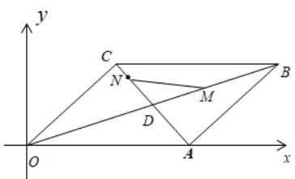

<!-- question-source:start -->
3.【问答题】如图，平行四边形OABC对角线交于点D，且 $\overrightarrow{DN}=2\overrightarrow{NC},\overrightarrow{DB}=2\overrightarrow{DM}$ ，若OA=2,OC= $\sqrt{2},\angle CO_{A}=45^{\circ}$ ，试求 $\overrightarrow{MN}$ 的坐标.

<!-- question-source:end -->

![[高中/课堂同步/智慧中小学/必修第二册/第六章 平面向量及其应用/6.3.4 平面向量数乘运算的坐标表示/6_3_4平面向量数乘运算的坐标表示_1_/smartedu_bixiu2_向量数乘坐标表示1/对点训练/answers/Q00056196A1.md]]
