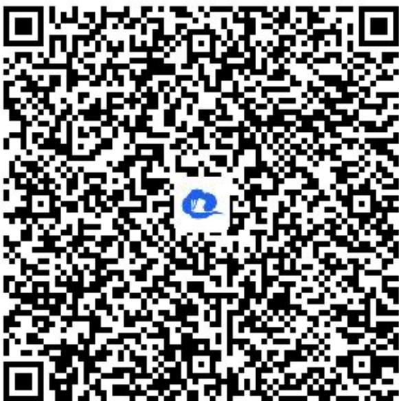

> [!faq]- 《smartedu_bixiu2_向量数乘坐标表示1》例题解析
>
> > [!success]- **【答案】** $\left(-\frac{13}{12},\frac{1}{12}\right)$
>
> > [!note]- **【解析】**
> > 【更多习题信息】
> >
> > 难易度：偏难
> >
> > 知识点：平面向量数乘运算的坐标表示
> >
> > 【智慧中小学APP扫码查看完整解析】
> >
> > 
