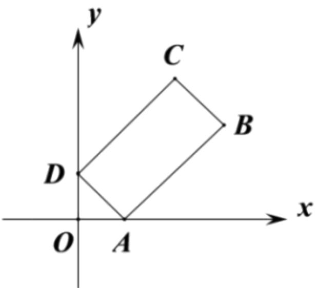

<!-- question-source:start -->
3.【问答题】3. 如图在矩形ABCD中，顶点A，D分别在x轴，y

轴的正半轴上（含原点）滑动，且矩形ABCD位于第一象限，若AD=1，AB=2，O为坐标原点，试求 $\overrightarrow{OB}\cdot\overrightarrow{OC}$ 的最大值.

<!-- question-source:end -->

![[高中/课堂同步/智慧中小学/必修第二册/第六章 平面向量及其应用/6.3.5 平面向量数量积的坐标表示/6_3_5平面向量数量积的坐标表示_1_/smartedu_bixiu2_向量数量积坐标表示1/对点训练/answers/Q00056201A1.md]]
