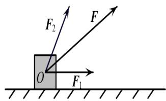

<!-- question-source:start -->
1.【单选题】如图，物体受到一个水平向右的力 $F_{1}$ 及与它成 $60^{\circ}$ 角的另一个力 $F_{2}$ 的作用. 已知 $F_{1}$ 的大小为2N，它们的合力F与水平方向成 $30^{\circ}$ 角，则 $F_{2}$ 的大小为（）.

A. $3\mathrm{N}$ B. $\sqrt{3}\mathrm{N}$ C. $2\mathrm{N}$ D. $\frac{1}{2}\mathrm{N}$
<!-- question-source:end -->

![[高中/课堂同步/智慧中小学/必修第二册/第六章 平面向量及其应用/6.4.2 向量在物理中的应用举例/6_4_2向量在物理中的应用举例/smartedu_bixiu2_向量物理应用举例/对点训练/answers/Q00056213A1.md]]
