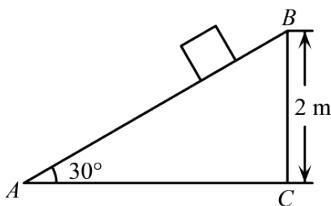

<!-- question-source:start -->
2.【问答题】如图，在倾角 $30^{\circ}$ ，高2m的坡面上，有一个质量为3kg

的物体沿坡面下滑，物体受到的摩擦力大小是它对坡面压力大小的 $\frac{1}{3}$ . 若重力加速度g=10 N/kg，求物体从坡顶B处滑落到坡低A

处的过程中，物体所受各力对物体所做的功分别是多少？

<!-- question-source:end -->

![[高中/课堂同步/智慧中小学/必修第二册/第六章 平面向量及其应用/6.4.2 向量在物理中的应用举例/6_4_2向量在物理中的应用举例/smartedu_bixiu2_向量物理应用举例/对点训练/answers/Q00056214A1.md]]
