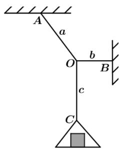

<!-- question-source:start -->
3.【问答题】如图，无弹性细绳OA，OB的一端分别固定在房顶的A处，与墙壁的B处，同样的细绳OC下端系着一个重物，所受的拉力是4N，此时 $\angle AOB = 120^{\circ}$ ， $OB \perp OC$ ，则细绳OA受到房顶的拉力是多少？

<!-- question-source:end -->

![[高中/课堂同步/智慧中小学/必修第二册/第六章 平面向量及其应用/6.4.2 向量在物理中的应用举例/6_4_2向量在物理中的应用举例/smartedu_bixiu2_向量物理应用举例/对点训练/answers/Q00056215A1.md]]
