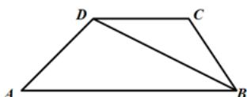

<!-- question-source:start -->
3.【填空题】如图，在梯形ABCD中， $AB \parallel CD$ ，AB = 33，CD = 21，AD = 14，BC = 10，则对角线BD = \_\_\_\_.

<!-- question-source:end -->

![[高中/课堂同步/智慧中小学/必修第二册/第六章 平面向量及其应用/6.4.3 余弦定理、正弦定理/6_4_3余弦_正弦定理_2_/smartedu_bixiu2_余弦定理_正弦定理/对点训练/answers/Q00056220A1.md]]
