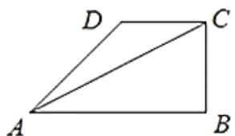

<!-- question-source:start -->
1. 【单选题】如图，设 $\triangle ABC$ 的内角 A, B, C 的对边分别为 a, b, c， $a\cos C + c\cos A = b\sin B$ ，且 $\angle CAB = \frac{\pi}{6}$ . 若点 D 是 $\triangle ABC$ 外一点，DC = 2，DA = 3，则当四边形 ABCD 面积最大值时， $\sin D = (\quad)$ .

A. $\frac{2\sqrt{7}}{7}$

B. $\frac{\sqrt{7}}{7}$

C. $\frac{2\sqrt{5}}{5}$

D. $\frac{\sqrt{5}}{5}$
<!-- question-source:end -->

![[高中/课堂同步/智慧中小学/必修第二册/第六章 平面向量及其应用/6.4.3 余弦定理、正弦定理/6_4_3余弦_正弦定理_5_/smartedu_bixiu2_余弦定理_正弦定理/对点训练/answers/Q00052517A1.md]]
