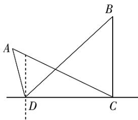

<!-- question-source:start -->
1. 【填空题】如图所示，为了测量A，B两处亭子间的距离，湖岸边现有相距100米的甲、乙两位测量人员，甲测量员在D处测量发现A亭子位于西偏北75°

，B 亭子位于东北方向，乙测量员在 C 处测量发现 B 亭子位于正北方向，A 亭子位于西偏北 $30^{\circ}$ 方向，则 A，B 两亭子间的距离为 \_\_\_\_。

<!-- question-source:end -->

![[高中/课堂同步/智慧中小学/必修第二册/第六章 平面向量及其应用/6.4.3 余弦定理、正弦定理/6_4_3余弦_正弦定理_6_/smartedu_bixiu2_余弦定理_正弦定理/对点训练/answers/Q00056228A1.md]]
