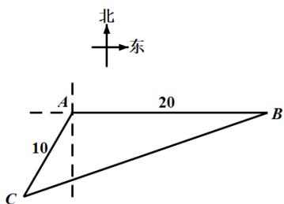

<!-- question-source:start -->
2.【复合题】如图，位于 $A$ 处的指挥中心获悉：在其正东方向相距20海里的 $B$

处有一艘渔船遇险，在原地等待营救．指挥中心立即把消息告知在其南偏西 $30^{\circ}$ ，相距10海里的C处的乙船，现乙船朝北偏东 $\theta$ 的方向沿直线CB前往B处救援.

(1)【问答题】求C,B两点间的距离;

(2)【问答题】求 $\cos\theta$ 的值.

<!-- question-source:end -->

![[高中/课堂同步/智慧中小学/必修第二册/第六章 平面向量及其应用/6.4.3 余弦定理、正弦定理/6_4_3余弦_正弦定理_6_/smartedu_bixiu2_余弦定理_正弦定理/对点训练/answers/Q00056229A1.md]]
