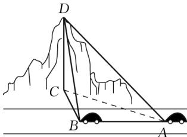

<!-- question-source:start -->
3.【问答题】如图，一辆汽车在一条水平的公路上向正西方向行驶，到A

处时测得公路北侧一山顶D在西偏北 $30^{\circ}$ 的方向上，行驶1200m后到达B处，并在B处测得山顶D在西偏北 $75^{\circ}$ 的方向上，且仰角为 $30^{\circ}$ ，求此山的高度CD。

<!-- question-source:end -->

![[高中/课堂同步/智慧中小学/必修第二册/第六章 平面向量及其应用/6.4.3 余弦定理、正弦定理/6_4_3余弦_正弦定理_6_/smartedu_bixiu2_余弦定理_正弦定理/对点训练/answers/Q00056230A1.md]]
