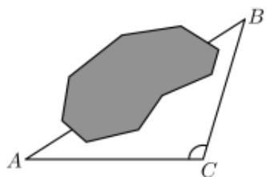

<!-- question-source:start -->
1. 【单选题】某地为响应国家关于生态文明建设的号召，大力开展“青山绿水”工程，造福于民，拟对该地某湖泊进行治理。在治理前，需测量该湖泊的相关数据。如图所示，测得 $\angle A = 23^{\circ}$ ， $\angle C = 120^{\circ}$ ， $AC = 60\sqrt{3}$ 米，则 $A, B$ 间的直线距离约为（参考数据 $\sin 37^{\circ} \approx 0.6$ ）（）.

B. 120米

C. 150米

D. 300米
<!-- question-source:end -->

![[高中/课堂同步/智慧中小学/必修第二册/第六章 平面向量及其应用/复习参考题6/第六章复习课/smartedu_bixiu2_第六章_平面向量及其应用_复习参考题/对点训练/answers/Q00056239A1.md]]
