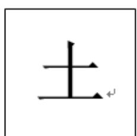
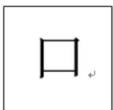
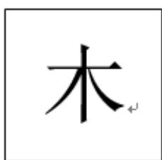

<!-- question-source:start -->
5.【问答题】汉字是世界上最古老的文字之一，字形结构体现着人类追求均衡对称、和谐稳定的天性.如图所示，这三个汉字可以看成轴对称图形.

小刘和小张利用 “土” “口” “木” 三个字设计了一个游戏，将三个汉字分别写在背面都相同的三张卡片上，背面朝上。规则如下：洗匀后抽出一张，放回洗匀后再抽一张，若两次抽出的汉字能构成上下结构的汉字（如 “土” “土” 构成 “圭”），则小刘获胜，否则小张获胜。你认为这个游戏公平吗？请说明理由。
<!-- question-source:end -->

![[高中/课堂同步/智慧中小学/必修第二册/第十章 概率/10.1.1 有限样本空间与随机事件/10_1_1有限样本空间与随机事件/三_问答题/习题/answers/Q00052536A1.md]]
