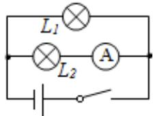

<!-- question-source:start -->
2.【复合题】如图，一个电路中有两个小灯泡和一个安培表，这三个电子设备可能正常，也可能不正常，把这个电路是否为通路看成一个随机现象，观察这个电路中三个电子设备是否正常.

(1)【问答题】选择适当的方式，写出试验的样本空间；

(2)【问答题】当闭合开关时，用集合表示下列事件：

$A = "L_{l}$ 亮起";

$B = "L_{1}$ 和 $L_{2}$ 同时亮起";

$C = "L_{2}$ 亮起但安培表不通";
<!-- question-source:end -->

![[高中/课堂同步/智慧中小学/必修第二册/第十章 概率/10.1.1 有限样本空间与随机事件/10_1_1有限样本空间与随机事件/二_复合题/习题/answers/Q00052533A1.md]]
