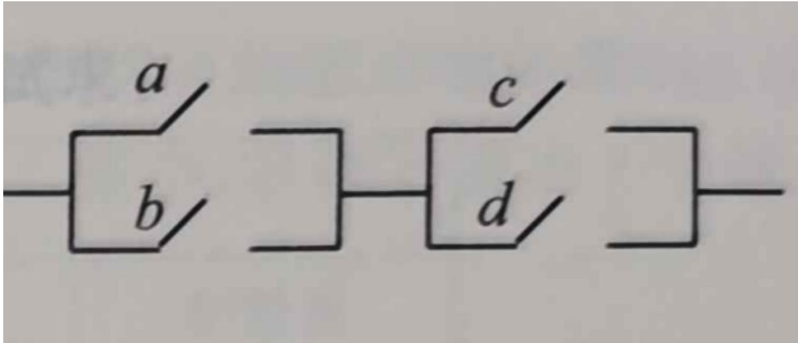

<!-- question-source:start -->
4.【复合题】如图：a,b,c,d

是4个当前处于断开状态的开关，此后每个开关可能闭合, 也可能断开. 把这个电路是否接通看成是一个随机现象，设事件 $A = \text{“}a$ 接通", $B = \text{“}b$ 接通", $C = \text{“}c$ 接通", $D = \text{“}d$ 接通”。

(1)【问答题】写出试验的样本空间；

(2)【问答题】用集合表示事件 $A \cap B, (A \cup C) \cap D$ ;

(3)【问答题】用集合表示事件 $(\overline{A} \cap \overline{C}) \cup \overline{D}$ ，并观察 $(A \cup C) \cap D$ 与 $(\overline{A} \cap \overline{C}) \cup \overline{D}$ 有什么关系.
<!-- question-source:end -->

![[高中/课堂同步/智慧中小学/必修第二册/第十章 概率/10.1.2 事件的关系与运算/10_1_2事件的关系和运算/三_复合题/习题/answers/Q00052546A1.md]]
