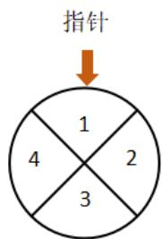

<!-- question-source:start -->
4. 【复合题】某儿童乐园在六一儿童节推出了一项趣味活动，参加活动的儿童需转动如图所示的转盘两次，每次转动后，待转盘停止转动时，记录指针所指区域中的数。设两次记录的数分别为x,y，奖励规则如下：若 $xy \leq 3$ ，则奖励玩具一个；若 $xy \geq 8$ ，则奖励水杯一个；其余情况奖励饮料一瓶。

假设转盘质地均匀，四个区域划分均匀. 小亮准备参加此项活动.

(1)【问答题】求小亮获得玩具的概率;

(2)【问答题】请比较小亮获得饮料和水杯哪个概率更大?

(3)【问答题】小亮获得玩具或水杯的概率.
<!-- question-source:end -->

![[高中/课堂同步/智慧中小学/必修第二册/第十章 概率/10.1.3 古典概型/10_1_3古典概型/一_复合题/习题/answers/Q00052540A1.md]]
