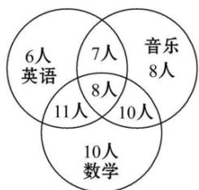

<!-- question-source:start -->
2.【多选题】（多选）某学校成立了数学、英语、音乐3个课外兴趣小组, 3个小组分别有39, 32, 33个成员, 一些成员参加了不止一个小组, 具体情况如图所示. 现随机选取一个成员, 则( )

A. 他只属于音乐小组的概率为 $\frac{1}{13}$ B. 他只属于英语小组的概率为 $\frac{8}{15}$ C. 他属于至少2个小组的概率为 $\frac{3}{5}$

D. 他属于不超过2个小组的概率为15
<!-- question-source:end -->

![[高中/课堂同步/智慧中小学/必修第二册/第十章 概率/10.1.4 概率的基本性质/10_1_4概率的基本性质/一_单选题/习题/answers/Q00052549A1.md]]
