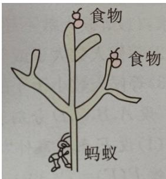

<!-- question-source:start -->
6.【问答题】一只蚂蚁在如图所示的树杈上寻觅食物，假定蚂蚁在每个岔路口都会等可能地随机地选择一条路径，则它能获得食物的概率是多少？

<!-- question-source:end -->

![[高中/课堂同步/智慧中小学/必修第二册/第十章 概率/10.1.4 概率的基本性质/10_1_4概率的基本性质/三_问答题/习题/answers/Q00052553A1.md]]
