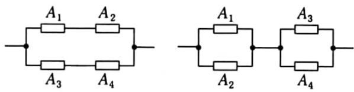

<!-- question-source:start -->
6.【问答题】如下图，设每个电子元件能正常工作的概率均为 $p(0 < p < 1)$ ，问甲、乙哪一种系统可靠性更大？

  
甲  
乙
<!-- question-source:end -->

![[高中/课堂同步/智慧中小学/必修第二册/第十章 概率/10.2 事件的相互独立性/10_2相互独立事件的概率/三_问答题/习题/answers/Q00052574A1.md]]
