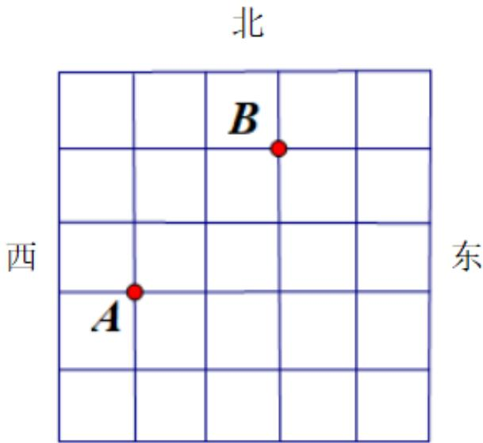

<!-- question-source:start -->
2.【复合题】如图是一个方形迷宫，甲、乙两人分别位于迷宫的A,B

两处，两人同时以每一分钟一格的速度向东、西、南、北四个方向行走，已知甲向东、西行走的概率都为 $\frac{1}{4}$ ，向南、北行走的概率分别为 $\frac{1}{6}$ 和p，乙向东、南、西、北四个方向行走的概率均为q.

  
南

(1) 求 P 和 q 的值;

问最少几分钟，甲、乙二人相遇？并求出最短时间内可以相遇的概率.
<!-- question-source:end -->

![[高中/课堂同步/智慧中小学/必修第二册/第十章 概率/10.2 事件的相互独立性/10_2相互独立事件的概率/二_复合题/习题/answers/Q00052568A1.md]]
