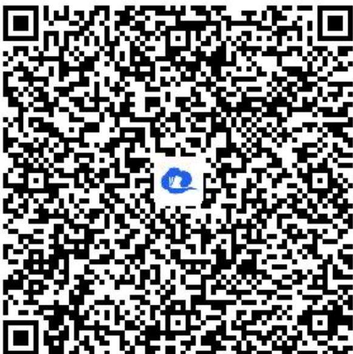

> [!faq]- 《3.1.1椭圆的标准方程（2）》答案与解析
>
> > [!success]- **【答案】** $\frac{x^2}{16} + \frac{y^2}{12} = 1 (y \neq 0)$
>
> > [!note]- **【解析】**
> > 【更多习题信息】
> > 难易度：适中
> > 知识点：与椭圆有关的轨迹问题
> > 【智慧中小学APP扫码查看完整解析】
> >
> > 
