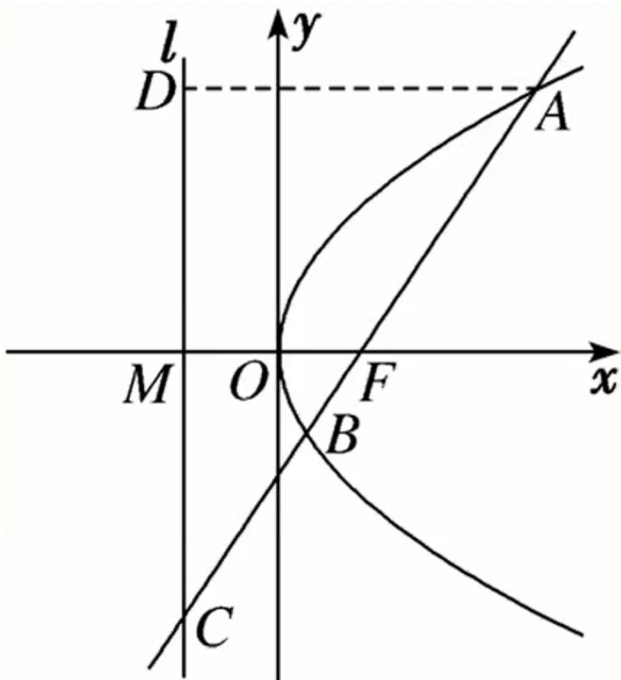

<!-- question-source:start -->
3.【单选题】如图，过抛物线 $y^{2}=2px(p>0)$ 的焦点F的直线交抛物线于点A，B，交其准线l于点C，若F是AC的中点，且 $|AF|=4$ ，则线段AB的长为（）

A. 5

B. 6

C. $\frac{16}{3}$

D. $\frac{20}{3}$
<!-- question-source:end -->

![[高中/课堂同步/智慧中小学/选择性必修第一册/第三章 圆锥曲线的方程/3.3.2 抛物线的简单几何性质/3_3_3_1抛物线应用_1_/一_单选题/习题/answers/Q00052117A1.md]]
