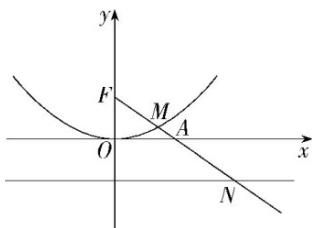

<!-- question-source:start -->
5.【单选题】如图, 已知点 $A(2,0)$ , 抛物线 $C: x^{2} = 4y$ 的焦点为 $F$ , 射线 $FA$ 与抛物线 $C$ 相交于点 $M$ , 与其准线相交于点 $N$ , 则 $|FM|: |MN| = (\quad)$

A. $2:\sqrt{5}$

B. 1:2

C. $1:\sqrt{5}$

D. 1:3
<!-- question-source:end -->

![[高中/课堂同步/智慧中小学/选择性必修第一册/第三章 圆锥曲线的方程/3.3.2 抛物线的简单几何性质/3_3_3_2抛物线应用_2_/一_单选题/习题/answers/Q00052124A1.md]]
