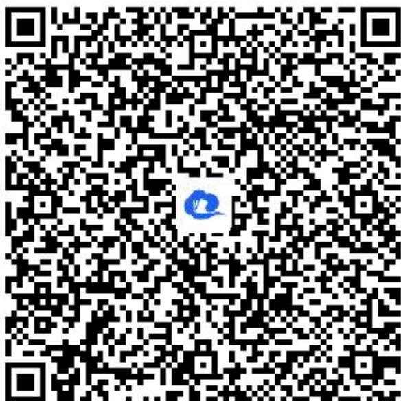

> [!faq]- 《圆锥曲线的方程小结（1）》答案与解析
>
> > [!success]- **【答案】** 详见解析
>
> > [!note]- **【解析】**
> > 证明： $\frac{I}{S_{1}^{2}}+\frac{I}{S_{2}^{2}}$ 为定值.
> >
> > 【正确答案】
> >
> > (1)【问答题】 $y^{2}=4x$
> >
> > (2)【问答题】 $\frac{l}{4}$
> >
> > 【更多习题信息】
> >
> > 难易度：适中
> >
> > 知识点：圆锥曲线中的定值问题
> >
> > 【智慧中小学APP扫码查看完整解析】
> >
> > 
