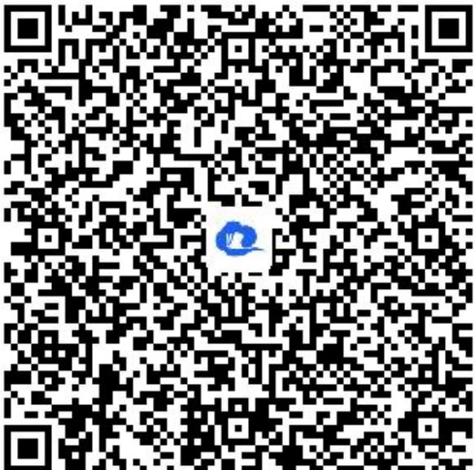

> [!faq]- 《2.1.1倾斜角与斜率》答案与解析
>
> > [!success]- **【答案】** C
>
> > [!note]- **【解析】**
> > 【更多习题信息】
> > 难易度：适中
> > 知识点：直线的倾斜角与方向向量
> > 【智慧中小学APP扫码查看完整解析】
> >
> > D. 直线的倾斜角 $\alpha$ 的集合 $\{\alpha | 0^{\circ} \leq \alpha \leq 180^{\circ}\}$ 与直线集合建立一一对应关系.
> > 【正确答案】C 【更多习题信息】 难易度：适中 知识点：直线的倾斜角与方向向量 【智慧中小学APP扫码查看完整解析】
> >
> > 
