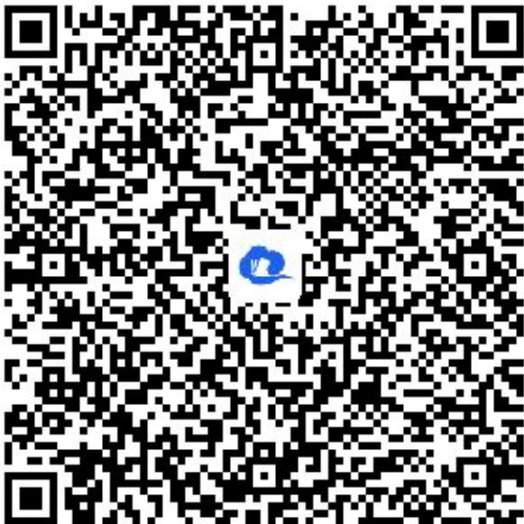

> [!faq]- 《2.1.1倾斜角与斜率》答案与解析
>
> > [!success]- **【答案】** 当l方向向上的部分在y轴左侧时，倾斜角为 $90^{\circ} + \alpha$ ；
>
> > [!note]- **【解析】**
> > 当l方向向上的部分在y轴右侧时，倾斜角为 $90^{\circ}-\alpha$ ，
> >
> > 【更多习题信息】
> >
> > 难易度：适中
> >
> > 知识点：斜率公式的应用
> >
> > 【智慧中小学APP扫码查看完整解析】
> >
> > 
