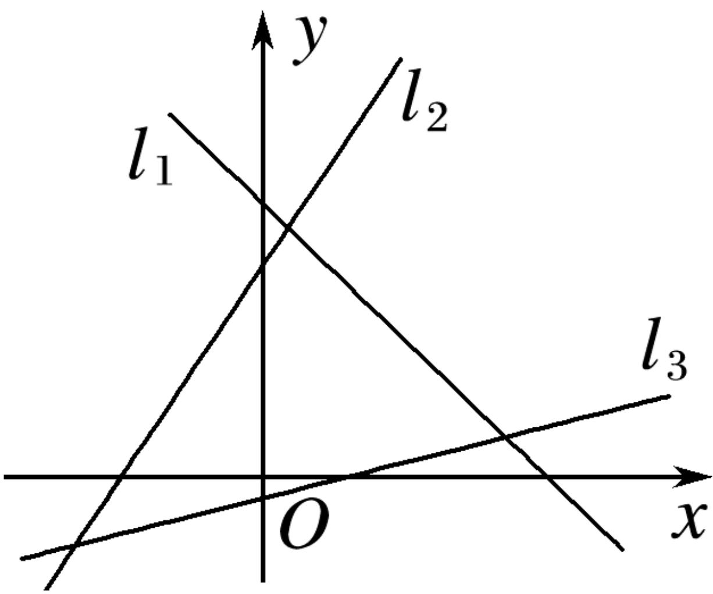

<!-- question-source:start -->
6.【填空题】若图中直线 $l_{1}$ , $l_{2}$ , $l_{3}$ 的斜率分别为 $k_{1}$ , $k_{2}$ , $k_{3}$ , 则 $k_{1}$ , $k_{2}$ , $k_{3}$ 的大小关系是\_\_\_\_。

<!-- question-source:end -->

![[高中/课堂同步/智慧中小学/选择性必修第一册/第二章 直线和圆的方程/2.1.1 倾斜角与斜率/2_1_1倾斜角与斜率/二_填空题/习题/answers/Q00052140A1.md]]
