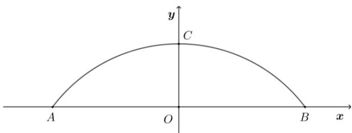

<!-- question-source:start -->
11.【复合题】为了开发古城旅游观光资源，镇政府决定在护城河上建一座圆形拱桥，河面跨度AB为32米，拱桥顶点C离河面8米.

(1)【问答题】如果以跨度AB所在直线为x轴，以AB中垂线为y

轴建立如图的直角坐标系，试求出该圆形拱桥所在圆的方程；

(2)【问答题】现有游船船宽8米，船舱顶部为长方形，船顶离水面7米，为保证安全，要求行船顶部与拱桥顶部的竖直方向高度差至少要

0.5米．问这条船能否顺利通过这座拱桥，并说出理由.
<!-- question-source:end -->

![[高中/课堂同步/智慧中小学/选择性必修第一册/第二章 直线和圆的方程/2.4.1 圆的标准方程/2_4_1圆的标准方程/四_复合题/习题/answers/Q00052246A1.md]]
