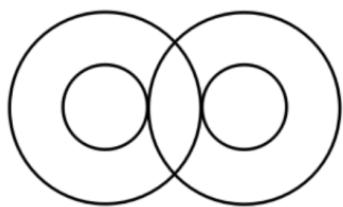

<!-- question-source:start -->
1. 【单选题】2021年是中国共产党百年华诞，3月24日，中宣部发布中国共产党成立100周年庆祝活动标识（图1），标识由党徽 数字“100”“1921”“2021”和56根光芒线组成，生动展现中国共产党团结带领中国人民不忘初心 牢记使命 艰苦奋斗的百年光辉历程。其中“100”的两个“0”设计为两个半径为R的相交大圆，分别内含一个半径为r的同心小圆，且同心小圆均与另一个大圆外切（图2）。已知 $R = (\sqrt{2} + 1)r$

，则由其中一个圆心向另一个大圆引的切线长与两大圆的公共弦长之比为（）

  
图1

  
图2

A. $\sqrt{2}$ B. $\sqrt{\frac{2}{2}}$ C. $\frac{\sqrt{2} + 1}{3}\frac{\sqrt{2} + 1}{3}$ D. $3(\sqrt{2} - 1)$
<!-- question-source:end -->

![[高中/课堂同步/智慧中小学/选择性必修第一册/第二章 直线和圆的方程/2.5.2 圆与圆的位置关系/2_5_2圆与圆的位置关系/一_单选题/习题/answers/Q00052221A1.md]]
