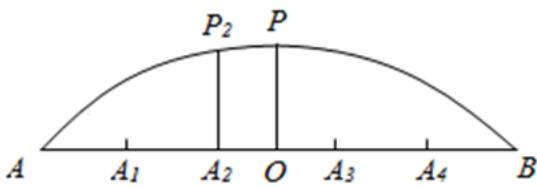

<!-- question-source:start -->
3.【填空题】如图是某圆拱形桥一孔圆拱的示意图.这个图的圆拱跨度AB=20m，拱高OP=4m，建造时每间隔4m需要用一根支柱支撑，则支柱 $A_{2}P_{2}=$ \_\_\_\_（参考数据： $\sqrt{30}$

$= 5.478$ ， $\sqrt{33} = 5.744$ ，精确到 $0.01m)$ ． A
<!-- question-source:end -->

![[高中/课堂同步/智慧中小学/选择性必修第一册/第二章 直线和圆的方程/小结/小结_2_/二_填空题/习题/answers/Q00052260A1.md]]
