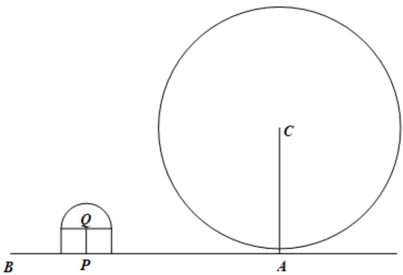

<!-- question-source:start -->
6. 【问答题】如图, 摩天轮底座中心A与附近的景观内某点B之间的距离AB为160m. 摩天轮与景观之间有一建筑物, 此建筑物由一个底面半径为15m的圆柱体与一个半径为15m的半球体组成. 圆柱的底面中心P在线段AB上, 且PB为45m. 半球体球心Q到地面的距离PQ为15m. 把摩天轮看做一个半径为72m的圆C, 且圆C在平面BPQ内, 点C到地面的距离CA为75m. 把摩天轮均匀旋转一周需要30min, 若某游客乘坐摩天轮 (把游客看作圆C上的一点) 旋转一周, 求该游客能看到点B的时长. (只考虑此建筑物对游客视线的遮挡)

知识点：直线与圆的位置关系在实际中的应用

<!-- question-source:end -->

![[高中/课堂同步/智慧中小学/选择性必修第一册/第二章 直线和圆的方程/小结/小结_2_/四_问答题/习题/answers/Q00052263A1.md]]
