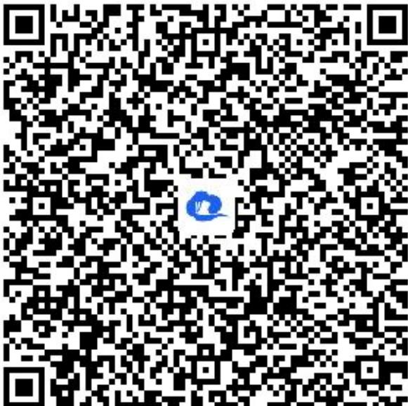

> [!faq]- 《离散型随机变量的分布列、均值与方差》答案与解析
>
> > [!success]- **【答案】** (1)
>
> > [!note]- **【解析】**
> > 所以，甲获得游戏奖品的概率 $P = \frac{l}{2} \times \frac{l}{2} + 2 \times \left(\frac{l}{2}\right)^4 + 5 \times \left(\frac{l}{2}\right)^6 = \frac{29}{64}$ .
> >
> > (2)【问答题】X的所有可能取值为 5，7，9，
> >
> > $$
> > P (X = 5) = \frac {1}{2} \times \frac {1}{2} = \frac {1}{4},
> > $$
> >
> > $$
> > P (X = 7) = 2 \times \left(\frac {1}{2}\right) ^ {4} + \left(\frac {1}{2}\right) ^ {4} = \frac {3}{1 6},
> > $$
> >
> > $$
> > P (X = 9) = 1 - P (X = 5) - P (X = 7) = \frac {9}{1 6}.
> > $$
> >
> > 所以 $X$ 的分布列为
> >
> > <table><tr><td>X</td><td>5</td><td>7</td><td>9</td></tr><tr><td>P</td><td> $\frac{1}{4}$ </td><td> $\frac{3}{16}$ </td><td> $\frac{9}{16}$ </td></tr></table>
> >
> > 则 $X$ 的数学期望 $E(X) = 5 \times \frac{1}{4} + 7 \times \frac{3}{16} + 9 \times \frac{9}{16} = \frac{61}{8}$ .
> >
> > 【提示】
> >
> > (1)【问答题】解析视频请查看最后一题。
> >
> > 【更多习题信息】
> >
> > 难易度：适中
> >
> > 知识点：离散型随机变量的分布列、期望
> >
> > 【智慧中小学APP扫码查看完整解析】
> >
> > 
