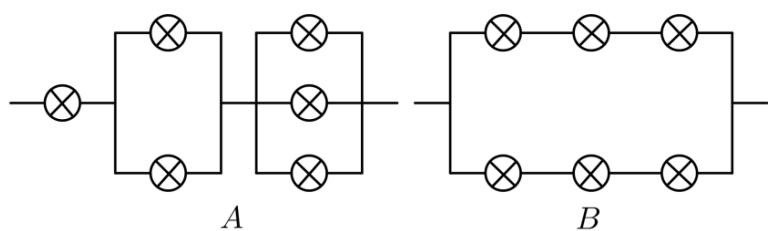

<!-- question-source:start -->
10.【填空题】如图所示的A，B两个电路中，每个元件接通的概率均为 $\frac{I}{2}$

，且每个元件是否接通互不影响，则这两个电路接通的概率分别为\_\_\_\_，\_\_\_\_。

<!-- question-source:end -->

![[高中/课堂同步/智慧中小学/选择性必修第三册/第七章 随机变量及其分布/小结/随机事件的相互独立性与条件概率/三_填空题/习题/answers/Q00051660A1.md]]
