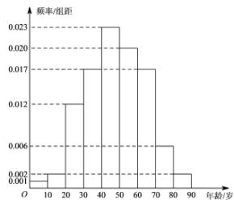

<!-- question-source:start -->
6.【复合题】在某地区进行流行病学调查，随机调查了100位某种疾病患者的年龄，得到如下的样本数据的频率分布直方图：

(1)【问答题】估计该地区这种疾病患者的平均年龄（同一组中的数据用该组区间的中点值为代表）；

(2)【问答题】估计该地区一位这种疾病患者的年龄位于区间[20,70)的概率;

(3)【问答题】已知该地区这种疾病的患病率为 $0.1\%$ ，该地区年龄位于区间[40,50)

的人口占该地区总人口的 $16\%$ . 从该地区中任选一人，若此人的年龄位于区间[40,50)

，求此人患这种疾病的概率．（以样本数据中患者的年龄位于各区间的频率作为患者的年龄位于该区间的概率，精确到0.0001）.
<!-- question-source:end -->

![[高中/课堂同步/智慧中小学/选择性必修第三册/第七章 随机变量及其分布/小结/随机变量及其分布_概率的综合应用/三_复合题/习题/answers/Q00051626A1.md]]
