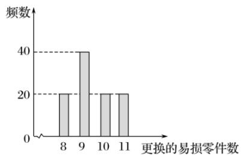

<!-- question-source:start -->
7. 【复合题】某公司计划购买2台机器，该种机器使用三年后即被淘汰，机器有一易损零件，在购进机器时，可以额外购买这种零件作为备件，每个200元．在机器使用期间，如果备件不足再购买，则每个500元．现需决策在购买机器时应同时购买几个易损零件，为此搜集并整理了100台这种机器在三年使用期内更换的易损零件数，得下面柱状图：

以这100台机器更换的易损零件数的频率代替1台机器更换的易损零件数发生的概率，记X表示2台机器三年内共需更换的易损零件数，n表示购买2台机器的同时购买的易损零件数.

(1)【问答题】求X的分布列;

(2)【问答题】若要求 $P(X \leqslant n) \geqslant 0.5$ ，确定n的最小值；

(3)【问答题】以购买易损零件所需费用的期望值为决策依据，在 $n = 19$ 与 $n = 20$ 之中选其一，应选用哪个？
<!-- question-source:end -->

![[高中/课堂同步/智慧中小学/选择性必修第三册/第七章 随机变量及其分布/小结/随机变量及其分布_概率的综合应用/三_复合题/习题/answers/Q00051627A1.md]]
