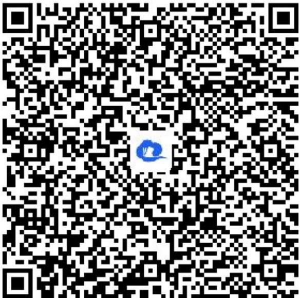

> [!faq]- 《随机变量及其分布_概率的综合应用》答案与解析
>
> > [!success]- **【答案】** (1)
>
> > [!note]- **【解析】**
> > 甲、乙在三小时以上且不超过四小时还车的概率分别为 $\frac{1}{4}$ ， $\frac{1}{4}$ ，
> >
> > 租车费相同，即两人都在同一时间段还车，
> >
> > 标记甲、乙两人所付的租车费用相同为事件A，
> >
> > 则 $P(A)=\frac{1}{4}\times\frac{1}{2}+\frac{1}{2}\times\frac{1}{4}+\frac{1}{4}\times\frac{1}{4}=\frac{5}{16},$
> >
> > 所以甲、乙两人所付的租车费用相同的概率为 $\frac{5}{16}$ .
> >
> > (2)【问答题】由题可知，X可能取的值有0，2，4，6，8，且
> >
> > $$
> > P (X = 0) = \frac {1}{4} \times \frac {1}{2} = \frac {1}{8}; P (X = 2) = \frac {1}{4} \times \frac {1}{4} + \frac {1}{2} \times \frac {1}{2} = \frac {5}{1 6};
> > $$
> >
> > $$
> > P (X = 4) = \frac {1}{2} \times \frac {1}{4} + \frac {1}{4} \times \frac {1}{2} + \frac {1}{4} \times \frac {1}{4} = \frac {5}{1 6}; P (X = 6) = \frac {1}{2} \times \frac {1}{4} + \frac {1}{4} \times \frac {1}{4} = \frac {3}{1 6}; P (X = 8) = \frac {1}{4} \times \frac {1}{4} = \frac {1}{1 6}
> > $$
> >
> > ．所以甲、乙两人所付的租车费用之和X的分布列为
> >
> > <table><tr><td>X</td><td>0</td><td>2</td><td>4</td><td>6</td><td>8</td></tr><tr><td>P</td><td> $\frac{1}{8}$ </td><td> $\frac{5}{16}$ </td><td> $\frac{5}{16}$ </td><td> $\frac{3}{16}$ </td><td> $\frac{1}{16}$ </td></tr></table>
> >
> > 【提示】
> >
> > (1)【问答题】解析视频请查看最后一题。
> >
> > 【更多习题信息】
> >
> > 难易度：适中
> >
> > 知识点：概率的综合应用
> >
> > 【智慧中小学APP扫码查看完整解析】
> >
> > 
