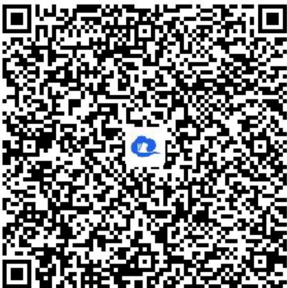

> [!faq]- 《随机变量及其分布_概率的综合应用》答案与解析
>
> > [!success]- **【答案】** (1)
>
> > [!note]- **【解析】**
> > 设 “获三等奖” 为事件A，由题意得 $P(A) \geqslant \frac{5}{9}$ ,
> >
> > 又 $P(A)=\frac{A_{n}^{3}}{n^{3}}=\frac{(n-1)(n-2)}{n^{2}}$ ,
> >
> > 所以 $\frac{(n - 1)(n - 2)}{n^2} \geqslant \frac{5}{9}$ , 整理得 $4n^2 - 27n + 18 \geqslant 0$ ,
> >
> > 解得 $n\leqslant\frac{3}{4}$ （舍去），或 $n\geqslant6$ ，所以n的最小值为6.
> >
> > (2)【问答题】38
> >
> > 设顾客在一次抽奖中获奖金额为随机变量 $\xi$ ，则 $\xi$ 的所有可能取值为108，60，18，
> >
> > 根据题意得 $P(\xi=108)=\frac{C_{6}^{l}}{6^{3}}=\frac{l}{36}$ ,
> >
> > $$
> > P _ {(\xi = 6 0)} = \frac {C _ {6} ^ {2} C _ {2} ^ {1} C _ {3} ^ {1}}{6 ^ {3}} = \frac {1 5}{3 6} = \frac {5}{1 2}, P _ {(\xi = 1 8)} = \frac {C _ {6} ^ {3} A _ {3} ^ {3}}{6 ^ {3}} = \frac {2 0}{3 6} = \frac {5}{9},
> > $$
> >
> > 所以 $\xi$ 的分布列为
> >
> > <table><tr><td>ξ</td><td>108</td><td>60</td><td>18</td></tr><tr><td>P</td><td> $\frac{1}{36}$ </td><td> $\frac{5}{12}$ </td><td> $\frac{5}{9}$ </td></tr></table>
> >
> > 所以 $E(\xi)=108\times\frac{1}{36}+60\times\frac{5}{12}+18\times\frac{5}{9}=38.$
> >
> > 【提示】
> >
> > (1)【问答题】解析视频请查看最后一题。
> >
> > 【更多习题信息】
> >
> > 难易度：适中
> >
> > 知识点：概率的综合应用
> >
> > 【智慧中小学APP扫码查看完整解析】
> >
> > 
