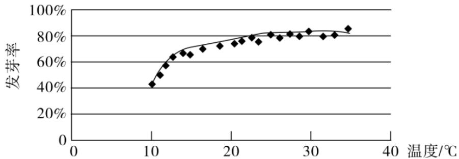

<!-- question-source:start -->
4.【单选题】某校一个课外学习小组为研究某作物种子的发芽率 y 和温度 x （单位：°C）的关系，在20个不同的温度条件下进行种子发芽实验，由实验数据 $(x_{i},y_{i})(i=1,2,\cdots,20)$ 得到下面的散点图：

由此散点图，在 $10^{\circ} \mathrm{C}$ 至 $40^{\circ} \mathrm{C}$ 之间，下面四个回归方程类型中最适宜作为发芽率 $y$ 和温度 $x$ 的回归方程类型的是（ ）  
A. $y = a + bx$ B. $y = a + b_{x}^{2}$ C. $y = a + b_{\mathrm{e}}^{x}$ D. $y = a + b\ln x$
<!-- question-source:end -->

![[高中/课堂同步/智慧中小学/选择性必修第三册/第八章 成对数据的统计分析/8.1 成对数据的统计相关性/一_单选题/习题/answers/Q00051672A1.md]]
