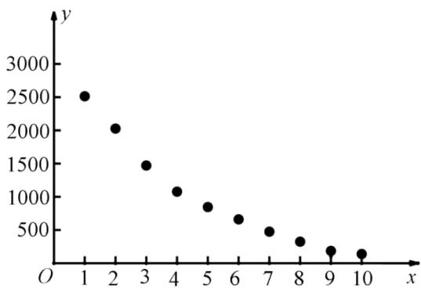

<!-- question-source:start -->
9.【填空题】x和y的散点图如图所示，则下列说法中所有正确命题的序号为\_\_\_\_。

① x, y 是负相关关系;

② x, y 之间不能建立线性回归方程;

③在该相关关系中，若用 $y = c_{1}e^{c_{2}x}$ 拟合时的决定系数为 $R_{1}^{2}$ ，用 $\hat{y} = \hat{b}x + \hat{a}$ 拟合时的决定系数为 $R_{2}^{2}$ ，则 $R_{1}^{2} > R_{2}^{2}$ .
<!-- question-source:end -->

![[高中/课堂同步/智慧中小学/选择性必修第三册/第八章 成对数据的统计分析/8.1 成对数据的统计相关性/三_填空题/习题/answers/Q00051677A1.md]]
