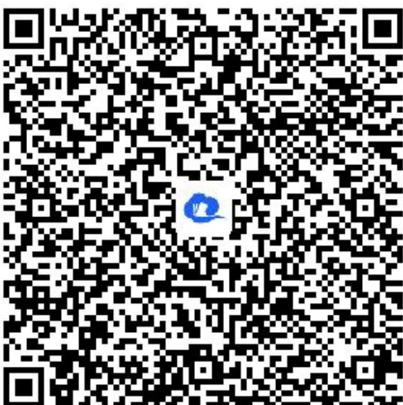

> [!faq]- 《一元回归方程的应用》答案与解析
>
> > [!success]- **【答案】** $\frac{17}{23}$
>
> > [!note]- **【解析】**
> > 【更多习题信息】
> >
> > 难易度：适中
> >
> > 知识点：一元线性回归方程参数的计算
> >
> > 【智慧中小学APP扫码查看完整解析】
> >
> >   
> > 四、复合题（共1题）
