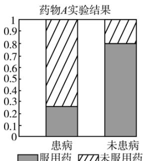

<!-- question-source:start -->
4.【单选题】为考查A，B

两种药物预防某疾病的效果，进行动物实验，分别得到如下等高条形图：根据图中信息，在下列各项中，说法最佳的一项是（）

<!-- question-source:end -->

![[高中/课堂同步/智慧中小学/选择性必修第三册/第八章 成对数据的统计分析/8.3 列联表与独立性检验/一_单选题/习题/answers/Q00051690A1.md]]
