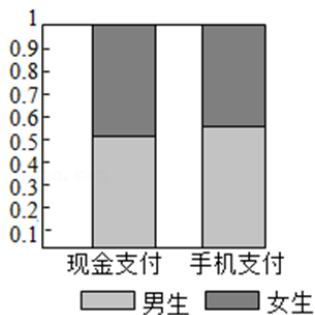
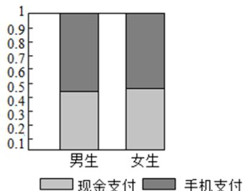

<!-- question-source:start -->
6. 【单选题】为了解高校学生使用手机支付和现金支付的情况，抽取了部分学生作为样本，统计其喜欢的支付方式，并制作出如下等高条形图：

根据图中的信息，下列结论中不正确的是（）
A. 样本中的男生数量多于女生数量
B. 样本中喜欢手机支付的数量多余现金支付的数量
C. 样本中多数男生喜欢手机支付
D. 样本中多数女生喜欢现金支付
<!-- question-source:end -->

![[高中/课堂同步/智慧中小学/选择性必修第三册/第八章 成对数据的统计分析/8.3 列联表与独立性检验/一_单选题/习题/answers/Q00051692A1.md]]
