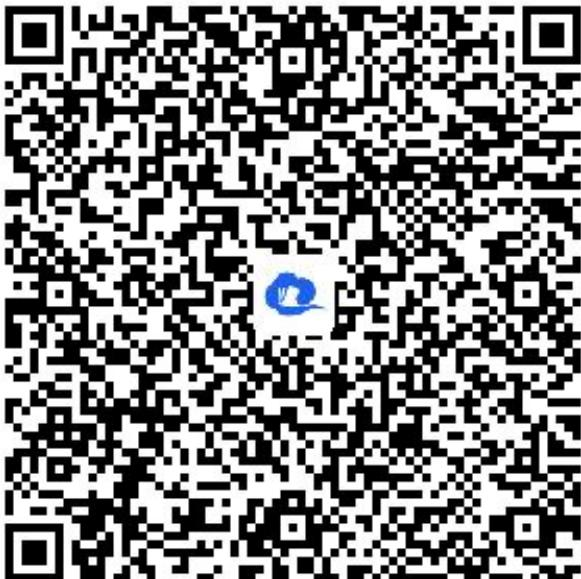

> [!faq]- 《列联表与独立性检验》答案与解析
>
> > [!success]- **【答案】** 详见解析
>
> > [!note]- **【解析】**
> > 注： $\chi^{2}=\frac{n(ad-bc)^{2}}{(a+b)(c+d)(a+c)(b+d)}$
> >
> > <table><tr><td> $P(\chi^{2} \geq x_{a})$ </td><td>0.100</td><td>0.050</td><td>0.025</td><td>0.010</td><td>0.005</td></tr><tr><td> $x_{a}$ </td><td>2.706</td><td>3.841</td><td>5.024</td><td>6.635</td><td>7.879</td></tr></table>
> >
> > A. 0.005
> >
> > B. 0.01
> >
> > D. 0.05
> >
> > 知识点：变量相关的分析、应用独立性检验解决实际问题
> > 【智慧中小学APP扫码查看完整解析】
> >
> > 
