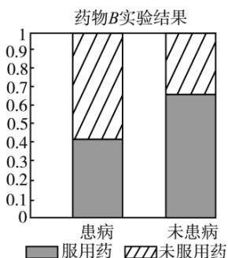

> [!faq]- 《列联表与独立性检验》答案与解析
>
> > [!success]- **【答案】** 详见解析
>
> > [!note]- **【解析】**
> > 
> >
> > A. 药物B的预防效果优于药物A的预防效果  
> > B. 药物A的预防效果优于药物B的预防效果  
> > C. 药物A, B对该疾病均有显著的预防效果  
> > D. 药物A, B对该疾病均没有预防效果
> >
> > 知识点：变量相关的分析、等高堆积条形图的应用
> > 【智慧中小学APP扫码查看完整解析】
> >
> > 
