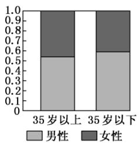
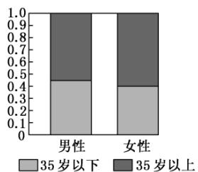

<!-- question-source:start -->
10.【多选题】(多选)

2018年12月1日，贵阳市地铁1号线全线开通，在一定程度上缓解了市内交通的拥堵状况。为了了解市民对地铁1号线开通的关注情况，某调查机构在地铁开通后的某两天抽取了部分乘坐地铁的市民作为样本，分析其年龄和性别结构，并制作出如下等高条形图：

根据图中(35岁以上含35岁)的信息，下列结论中一定正确的是（）
A. 样本中男性比女性更关注地铁1号线全线开通
B. 样本中多数女性是35岁以上
C. 样本中35岁以下的男性人数比35岁以上的女性人数多
D. 样本中35岁以上的人对地铁1号线的开通关注度更高
<!-- question-source:end -->

![[高中/课堂同步/智慧中小学/选择性必修第三册/第八章 成对数据的统计分析/8.3 列联表与独立性检验/二_多选题/习题/answers/Q00051696A1.md]]
