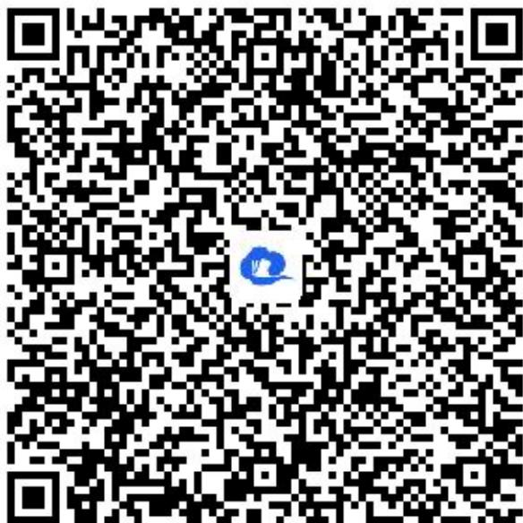

> [!faq]- 《列联表与独立性检验》答案与解析
>
> > [!success]- **【答案】** (1)
>
> > [!note]- **【解析】**
> > <table><tr><td></td><td>运动达人</td><td>参与者</td><td>合计</td></tr><tr><td>男员工</td><td>120</td><td>40</td><td>160</td></tr><tr><td>女员工</td><td>80</td><td>40</td><td>120</td></tr><tr><td>合计</td><td>200</td><td>80</td><td>280</td></tr></table>
> >
> > (2)【问答题】由列联表可得 $\chi^{2}=\frac{280(120\times40-40\times80)^{2}}{200\times80\times160\times120}\approx2.333<2.706,$
> >
> > 所以没有90%的把握认为获得“运动达人”称号与性别有关.
> >
> > 【提示】
> >
> > (1)【问答题】解析视频请查看最后一题。
> >
> > 【更多习题信息】
> >
> > 难易度：适中
> >
> > 知识点：应用独立性检验解决实际问题、变量相关的分析
> >
> > 【智慧中小学APP扫码查看完整解析】
> >
> > 
