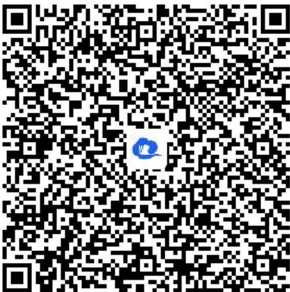

> [!faq]- 《列联表与独立性检验》答案与解析
>
> > [!success]- **【答案】** (1)
>
> > [!note]- **【解析】**
> > 乙机床生产的产品中一级品的频率为 $\frac{120}{200}=0.6$ .
> >
> > (2)【问答题】假设 $H_{0}$ ：甲机床的产品质量与乙机床的产品质量无差异；
> >
> > $\because \chi^{2} = \frac{400\times(150\times 80 - 50\times 120)^{2}}{200\times 200\times 270\times 130} = \frac{400}{39} >10 > 3.841,$
> >
> > ∴ 根据 $\alpha = 0.050$ 的独立性检验，可推断 $H_{0}$
> >
> > 不成立，即可以认为甲机床的产品质量与乙机床的产品质量有差异.
> >
> > 【提示】
> >
> > (1)【问答题】解析视频请查看最后一题。
> >
> > 【更多习题信息】
> >
> > 难易度：适中
> >
> > 知识点：应用独立性检验解决实际问题、变量相关的分析
> >
> > 【智慧中小学APP扫码查看完整解析】
> >
> > 
