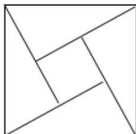

<!-- question-source:start -->
3. 【单选题】如图为我国数学家赵爽（约3世纪初）在为《周髀算经》作注时验证勾股定理的示意图，现在提供5种颜色给其中5个小区域涂色，规定每个区域只涂一种颜色，相邻区域颜色不相同，则不同的涂色方案共有种

A.120  
B.260  
C.340  
D.420
<!-- question-source:end -->

![[高中/课堂同步/智慧中小学/选择性必修第三册/第六章 计数原理/6.1 分类加法计数原理与分步乘法计数原理/加法计数原理与乘法计数原理/一_单选题/习题/answers/Q00051600A1.md]]
