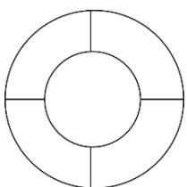

<!-- question-source:start -->
6.【单选题】如图，节日花坛中有5个区域，现有四种不同颜色的花卉可供选择，要求相同颜色的花不能相邻栽种，则符合条件的种植方案有（）种.

A. 36
B. 48
C. 54
D. 72
<!-- question-source:end -->

![[高中/课堂同步/智慧中小学/选择性必修第三册/第六章 计数原理/6.1 分类加法计数原理与分步乘法计数原理/加法计数原理与乘法计数原理/一_单选题/习题/answers/Q00051603A1.md]]
