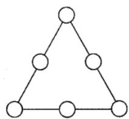

<!-- question-source:start -->
9.【填空题】如图，在三角形三条边上的6个不同的圆内分别填入数字1，2，3中的一个.

(i) 当每条边上的三个数字之和为4时，不同的填法有\_\_\_\_种；

（ii）当同一条边上的三个数字都不同时，不同的填法有种\_\_\_\_。

<!-- question-source:end -->

![[高中/课堂同步/智慧中小学/选择性必修第三册/第六章 计数原理/6.1 分类加法计数原理与分步乘法计数原理/加法计数原理与乘法计数原理/三_填空题/习题/answers/Q00051606A1.md]]
